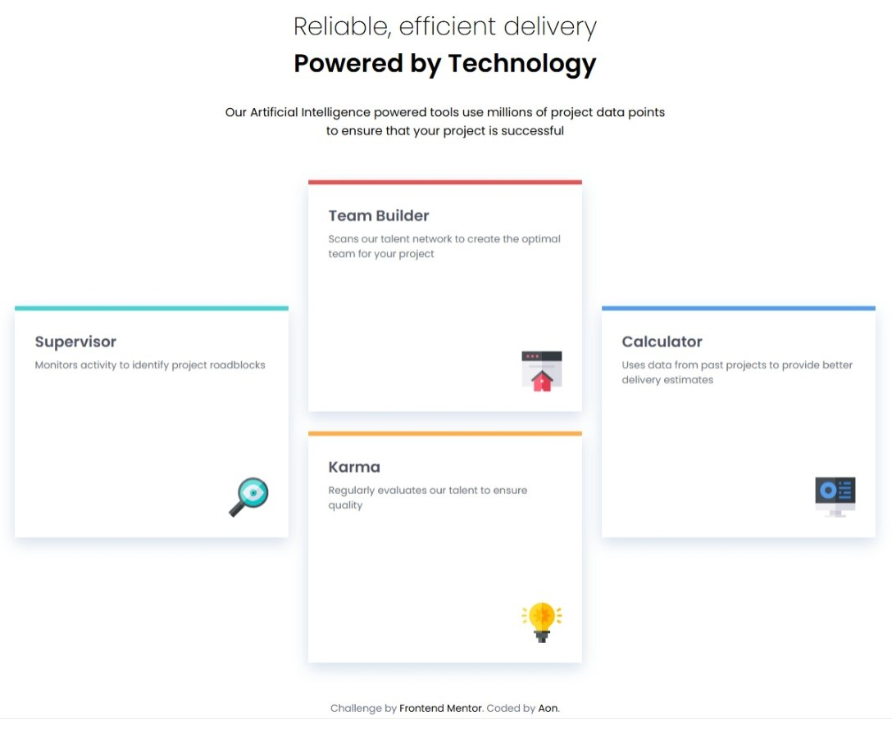

# Frontend Mentor - Four card feature section solution

This is a solution to the [Four card feature section challenge on Frontend Mentor](https://www.frontendmentor.io/challenges/four-card-feature-section-weK1eFYK). Frontend Mentor challenges help you improve your coding skills by building realistic projects.

## Table of contents

- [Frontend Mentor - Four card feature section solution](#frontend-mentor---four-card-feature-section-solution)
  - [Table of contents](#table-of-contents)
  - [Overview](#overview)
    - [The challenge](#the-challenge)
    - [Screenshot](#screenshot)
    - [Links](#links)
  - [My process](#my-process)
    - [Built with](#built-with)
    - [What I learned](#what-i-learned)
    - [Useful resources](#useful-resources)
  - [Author](#author)

## Overview

### The challenge

Users should be able to:

- View the optimal layout for the site depending on their device's screen size

### Screenshot

<div style="display: flex; gap: 1rem; align-items: flex-start; width: clamp(600px, 90%, 1000px); height: 550px;">
  <figure style="margin: 0; height: 100%; text-align: center;">
    <figcaption>Mobile preview</figcaption>
    

  </figure>
  <figure style="margin: 0; width: 80%; text-align: center;">
    <figcaption>Desktop preview</figcaption>
    
  </figure>
</div>

### Links

- [Solution URL](https://github.com/Aon-m/Four-Card-Responsive-Webpage)
- [Live Site URL](https://aon-m.github.io/Four-Card-Responsive-Webpage/)

## My process

### Built with

- Semantic HTML5 markup
- CSS custom properties
- Flexbox
- CSS Grid
- Mobile-first workflow

### What I learned

This project showed me the gaps in my knowledge and the areas I needed to improve. As a result, I deepened my understanding of CSS Grid and CSS Variables—snippets related to these concepts can be found below—as seen in the difference between this project and the previous one.

**CSS Grids:**
``` css
.work-area {
  display: grid;
  grid-template-columns: 1fr;
  grid-template-rows: auto 1fr auto;
  grid-template-areas:
    ""
    ""
    "";
}
```
**CSS Variables:**
``` css
:root {
  --custom-name: value;
}
```

### Useful resources

- [Learn CSS grid](https://youtu.be/EiNiSFIPIQE?si=aD9WLFIMna8RWpO8) - As a beginner at css grids, this was really helpful; introducing the core concepts in a clear and concise manner.
- [CSS Variables 101: Mastering Custom Properties](https://youtu.be/LjwwtkqaEtQ?si=ASi7n5Ag-rCfsS2t) - This introduced the core principles and ideas behind CSS Variables.

## Author

- CSSbattle - [@aon](https://cssbattle.dev/player/aon)
- Frontend Mentor - [@Aon-m](https://www.frontendmentor.io/profile/Aon-m)
